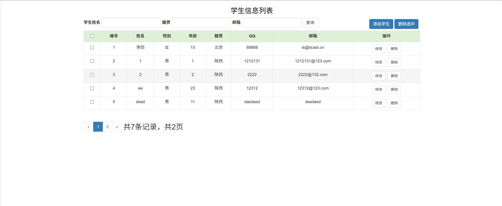

# jspServlet001
jspServlet001学生信息管理系统+BG
 
## 查看主页获取源码

### 一、关键词
学生信息系统，学生系统管理系统

### 二、作品包含
源码+数据库+设计报告文档+全套环境和工具资源+本地部署教程

### 三、项目技术
前端技术：Html、Css、Js、Jquery、Bootstrap
后端技术：Java、JSP、Servlet、JDBC

### 四、运行环境（以下版本亲测，其他版本兼容性请自行测试）
开发工具：IDEA/eclipse

数据库：MySQL5.7

服务器：Tomcat8.5

数据库管理工具：Navicat10以上版本

环境配置软件： JDK1.8

浏览器：谷歌浏览器

### 五、项目介绍
项目编号：jspServlet001

学生信息管理系统开发主要包括数据库的建立和维护以及应用程序的开发两个方面。要求建立起数据一致性和完整性强。数据安全性好的库，要求应用程序功能完备，易使用等特点。

一、功能需求
管理员登录注册：管理员可以通过输入用户名和密码进行登录，如果没有账号，可以进行注册。
学生信息增删改查：管理员可以对学生信息进行增加、删除、修改和查询操作。
二、非功能需求
安全性：系统需要保证数据的安全性，防止未经授权的访问和操作。
可用性：系统需要具有良好的用户体验，操作简单易懂。
性能：系统需要能够处理大量的数据，响应速度快。
三、界面需求
登录界面：管理员输入用户名、密码和验证码进行登录。
注册界面：管理员输入用户名、密码进行注册。
学生信息管理界面：管理员可以查看所有学生的信息，也可以进行增加、删除、修改和查询操作。
四、数据库需求
学生表：包含学生的基本信息，如姓名、性别、年龄、邮箱等。
管理员表：包含管理员的基本信息，如用户名、密码。
五、系统流程
管理员登录：管理员输入用户名和密码，系统验证后进入学生信息管理界面。
管理员注册：管理员输入用户名、密码后完成注册。
学生信息管理：管理员可以查看所有学生的信息，也可以进行增加、删除、修改和查询操作。

### 六、运行截图

